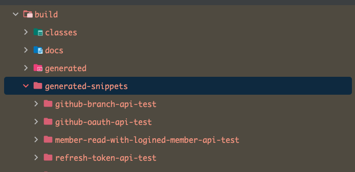
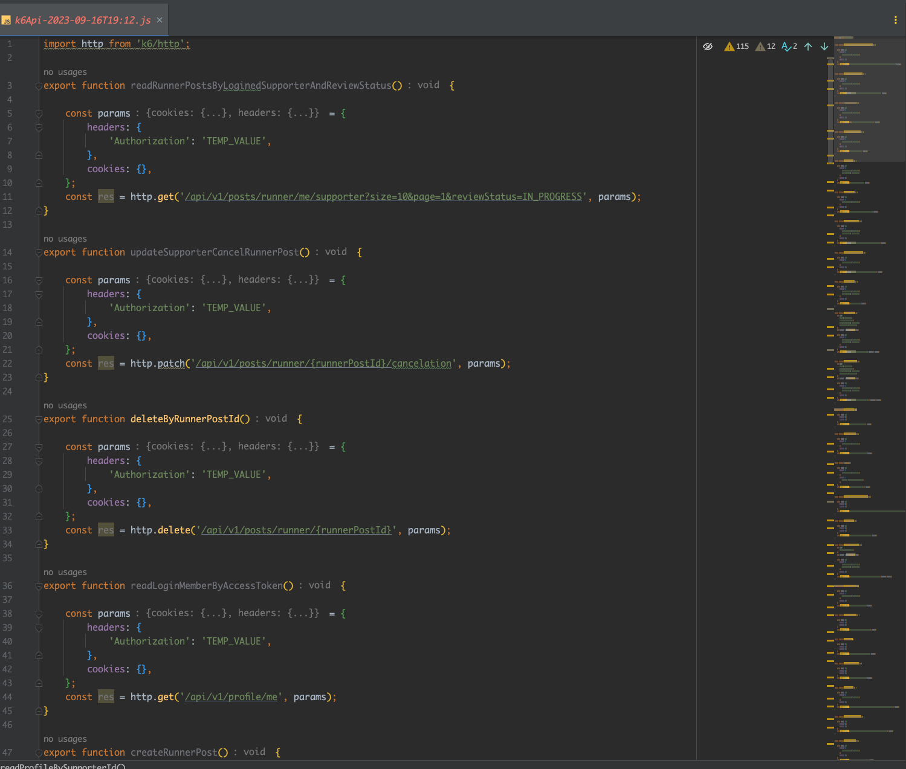

# Adoc To 'k6/Http' API Script

K6 테스트를 이용할 때 모든 API를 하나하나 가져오는 것을 부분 자동화했습니다.

단순한 api 요청 메서드만 만드는 정도입니다.

<br>
<br>
<br>

아래와 같은 adoc 파일을 이용해서 함수를 작성합니다.

- http-request.adoc
- query-parameters.adoc
- path-parameters.adoc
- request-fields.adoc
- request-headers.adoc
- request-cookies.adoc

### 예시) Header + RequestBody

- data 는 RequestBody 를 의미합니다.
- params 는 headers, cookies 등이 있을 수 있습니다.
- 값은 들어가지 않아 `TEMP_VALUE`로 나와 있은 삭제 후 필요한 값으로 수정해주세요.
- 목록으로 들어가는 경우 파싱이 미완성 되어 `.[]`를 삭제 후 필요한 포맷에 맞게 수정해주세요.

```js
export function updateExample() {
    let data = {
        'name': 'TEMP_VALUE',
        'company': 'TEMP_VALUE',
        'introduction': 'TEMP_VALUE',
    };
    let jsonData = Json.stringify(data);

    const params = {
        headers: {
            'Authorization': 'TEMP_VALUE',
            'Content-Type': 'TEMP_VALUE',
        },
        cookies: {},
    };
    const res = http.patch('/api/v1/examples', jsonData, params);
}
```

### 예시) Query Parameters

- Query Parameters 의 value 는 `TEMP_VALUE` 로 수정되어 있지 않으니 주의해주세요.
- value 를 삭제 후 필요한 값으로 수정해주세요.

```js
export function readExampleByMemberId() {

    const params = {
        headers: {},
        cookies: {},
    };
    const res = http.get('/api/v1/examples/search?size=10&page=1&memberId=1', params);
}
```

### 예시) Path Parameters

- Path Parameters 의 경우 value 가 adoc 를 기준으로 `{value 명}`으로 입력되어 있습니다.
- `{value 명}`을 삭제 후 필요한 값으로 수정해주세요.

```js
export function readExampleProfile() {

    const params = {
        headers: {},
        cookies: {},
    };
    const res = http.get('/api/v1/examples/profile/{memberId}', params);
}
```

<br>
<br>
<br>

## 사용법

build/generated-snippets 를 기준으로 탐색하고 있습니다.



리플랙션을 이용하고 있습니다. 의존성을 추가해주세요.

```groovy
// reflection 의존성 추가
implementation "org.reflections:reflections:0.10.2"
```

### K6ScriptExtractor 실행하여 js 파일 추출

- main을 실행하시면 최상단 디렉터리에 `js`가 생성됩니다.
- `js`는 정렬되어 있지 않은 상태로 자동 정렬을 하시면 됩니다.
- `build/generated-snippets`의 경로가 다를 경우 `SNIPPETS_DIR` 경로를 수정해주세요.

```java
public class K6ScriptExtractor {

    private static final File SNIPPETS_DIR = new File("build/generated-snippets");

    public static void main(String[] args) {
        // ...
    }
}
```

아래와 같은 파일을 보실 수 있습니다.


